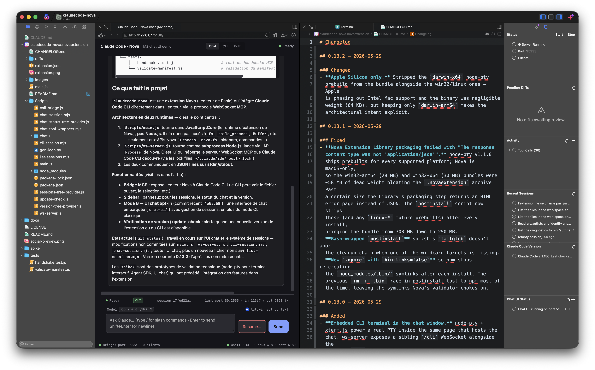

# Claude Code Bridge for Nova

> Integrate Claude Code CLI with [Nova](https://nova.app) (by Panic) through the WebSocket MCP protocol — the same protocol used by the official VS Code and JetBrains extensions.

[](LICENSE)
[](https://nova.app)
[](https://nodejs.org)
[](https://www.lcieducation.com)



## Why?

Claude Code has official IDE integrations for VS Code and JetBrains, but nothing for Nova. If you love Nova's native macOS experience and want Claude Code's full agentic capabilities — context sharing, inline diffs, selection tracking — this extension bridges the gap.

The approach was pioneered by [coder/claudecode.nvim](https://github.com/coder/claudecode.nvim) for Neovim. This project brings the same idea to Nova using its JavaScript extension API.

## How It Works

The Nova extension (`main.js`) spawns a Node.js subprocess (`ws-server.js`) that runs a WebSocket server implementing the [MCP (Model Context Protocol)](https://modelcontextprotocol.io). Claude Code CLI discovers it through a lock file at `~/.claude/ide/<port>.lock` — the same mechanism used by the official VS Code / JetBrains extensions. JSON-RPC 2.0 over WebSocket on localhost only, gated by a UUID token. The opt-in chat panel runs a second HTTP/WebSocket server (default `127.0.0.1:5180`) that shares the same workspace context.

## Features

- **Automatic context sharing** — Claude Code sees your active file, selection, and workspace structure
- **Selection tracking** — Real-time selection broadcasts as you navigate and select code
- **Diff review** — Accept or reject Claude's proposed changes; user edits in the proposed-changes tab are preserved on Accept and signalled back to Claude
- **File operations** — Claude can open files, save documents, and check for unsaved changes
- **Six live sidebar sections** — Connection status · pending-diffs queue with per-item Accept/Reject · activity log of file ops + diff outcomes · recent sessions for the workspace · Claude Code CLI version · Chat UI status (auto-refreshes every 30 s)
- **One-click launch** — Open Claude Code in iTerm or Terminal.app with the IDE-bridge env vars pre-set; the bridge connects automatically
- **Opt-in embedded chat + terminal** — In-window chat on a persistent Claude Code session (Anthropic API key, or your Claude Code login) with permission prompts, interrupt and image attachments, plus a real PTY-backed terminal panel, both on a single localhost HTTP server
- **24 slash commands** — Code-on-selection (`/explain`, `/refactor`, `/test`, `/doc`, `/fix`, `/review`, `/optimize`, `/simplify`, `/types`, `/security`, `/rename`), git-driven (`/commit`, `/changelog`, `/pr`), workspace (`/explain-error`, `/why`, `/search`, `/find`), conversation (`/plan`, `/recap`, `/clear`), documentation (`/spec`, `/readme`, `/api-doc`)
- **Live session status via Claude Code hooks** — Opt-in: the extension installs async hooks into `~/.claude/settings.json` that relay Claude Code's session events to the bridge. Recent Sessions then shows every running session as 🟢 working (with the tool in flight), 🟠 waiting for you, ⚪ idle or 🔴 failed — including sessions started in a terminal, outside the bridge. Optional notifications when Claude blocks on a permission prompt or finishes a turn
- **Resume any session** — Click an entry in the Recent Sessions sidebar (or the chat's "Resume…" menu) to replay + continue any prior conversation from `~/.claude/projects/<workspace>/*.jsonl`
- **Secure by default** — Localhost-only servers; the MCP bridge, the chat and the embedded terminal each require a secret token, and the chat/terminal WebSockets also refuse foreign `Origin`/`Host` headers. No data leaves the machine

## Modes — Chat (web) and CLI panel (in-browser terminal)

In addition to the traditional Mode A (Claude Code CLI in an external terminal talking to Nova through the MCP bridge), v0.6+ ships an opt-in browser-based chat surface and v0.13+ embeds a real terminal inside the same window. Both run on a single localhost HTTP server (default `http://127.0.0.1:5180/`) spawned by the extension.

### Chat (web)

A pure HTML/CSS/JS chat UI served by the bundled `chat-session.mjs`. The backend is the Claude Agent SDK in *streaming input* mode — one persistent Claude Code process per chat session, so follow-ups don't pay a cold start, Stop interrupts the current turn without losing the conversation, images attach in every mode, and permission prompts show up in the chat. Two auth modes are auto-selected:

- **SDK mode** — when an Anthropic API key is resolved (Keychain → 1Password → direct config in that order). Cost-tuned: Claude Code's built-in tools are off and the 24 Nova editor + workspace tools are the only tools. Billed against the API key; badge `SDK`.
- **OAuth mode** — when no API key is configured, the SDK launches *your* `claude` binary with your Claude Code login (Pro / Max / Enterprise), the full built-in toolset and your user + project settings (skills, plugins, hooks) — your terminal experience, in the chat. Usage is covered by the subscription; the cost shown is the API equivalent. Badge `OAuth`.

**Permission prompts** — tools the permission mode (`claudecode.chat.cliPermissionMode`) doesn't pre-approve pause the turn and show a card with *Allow / Always allow / Deny*. Nova editor tools are always pre-approved.

What both modes have in common:

- **24 slash commands** with a filterable menu (arrow keys, Enter/Tab, Esc to cancel) :
   - *Code on selection* — `/explain`, `/refactor`, `/test`, `/doc`, `/fix`, `/review`, `/optimize`, `/simplify`, `/types`, `/security`, `/rename`
   - *Git-driven* — `/commit` (Conventional Commits draft from the current diff), `/changelog` (Keep-A-Changelog from commits since last tag), `/pr` (full PR template)
   - *Workspace* — `/explain-error` (stack-trace triage), `/why` (intent behind selected code), `/search` (literal grep), `/find` (symbol-definition regex)
   - *Conversation* — `/plan` (decompose a task into steps), `/recap` (summarize the session), `/clear` (frontend-only history wipe)
   - *Documentation* — `/spec`, `/readme`, `/api-doc`
- "Auto-inject context" toggle that prepends the current Nova selection + file path to every prompt
- Live model picker, discovered at startup — from your Claude Code install in OAuth mode (the same list as its `/model` command, with descriptions), from the Anthropic API in SDK mode — switch mid-conversation, no restart
- Streaming `💭 Reasoning…` collapsible block while Claude thinks before answering
- "Resume…" button — lists per-workspace sessions from `~/.claude/projects/<encoded-cwd>/*.jsonl`, click replays the full transcript and continues with `--resume`
- Theme follows macOS / Nova appearance (`prefers-color-scheme`) with a manual override setting (`claudecode.chat.theme`) if Nova's locked to a different mode

### CLI panel (in-browser terminal)

An embedded terminal inside the chat page powered by [xterm.js](https://xtermjs.org/) (client) + [node-pty](https://github.com/microsoft/node-pty) (server, real PTY via `posix_spawnp`). Spawns `claude` with the user-configured CLI command and args (`claudecode.claudeCommand` / `claudecode.claudeArgs`) and pipes input/output/resize over a WebSocket at `/cli`.

This isn't a polished terminal emulator — it's literally `claude` running with a PTY backend. You get:

- Raw mode + ANSI escape sequences + colors (Claude Code's TUI renders correctly)
- All the official `claude` features that depend on TTY detection (interactive prompts, vim-style keybindings, `Esc+Enter` multiline)
- Same `~/.claude/projects/<encoded-cwd>/*.jsonl` history Claude Code uses elsewhere — so a session you start here can be resumed from any other terminal and vice-versa
- The full Claude Code skills / plugins / agents ecosystem (slash commands like `/architecture review`, sub-agents, hooks) — because the runtime is the real `claude` CLI

### Layout toggle

Three positions in the chat-page topbar:

- **Chat** — chat panel only
- **CLI** — terminal panel only
- **Both** — terminal on top, chat below, with a draggable horizontal splitter (re-fits the xterm grid live as you drag and tells the PTY about the new dimensions)

A single Anthropic conversation can span both panels in Both mode: ask Claude something in the chat, watch it use tools, then drop into the CLI to follow up — both surfaces share the same Claude Code session via `--resume`.

### Where to open the chat window

Three buttons in the "Open Claude Chat" command's action panel:

- **Open in Nova Preview** — writes a small iframe wrapper file under the extension's global storage and opens it as a Nova editor tab; `Cmd+Shift+H` shows it in Nova's WebKit Preview, drag the tab to dock side-by-side with your code (closest approximation to VS Code's beside-panel webview that Nova's API allows)
- **Open in Browser** — Safari / Firefox / your default
- **Copy URL** — drop into any browser tab manually

The URL carries a private access token (`?token=…`), required by the chat and terminal WebSockets since 0.24.0. If you dock the chat through Nova's own **Preview URL** project setting instead (`workspace.preview_url`, stored in the gitignored `.nova/Configuration.json`), point it at the tokenized URL from "Copy URL" — a bare `http://127.0.0.1:5180/` shows "Missing access token". Both the iframe wrapper and that setting are refreshed automatically by the bridge whenever the chat starts with a URL they no longer match (rotated token, port change), so an already-docked panel keeps working.

## Requirements

| Dependency | Minimum Version |
|------------|----------------|
| [Nova](https://nova.app) | 10.0 |
| [Node.js](https://nodejs.org) | 18.0 |
| [Claude Code CLI](https://docs.anthropic.com/en/docs/claude-code) | Latest — required by the bridge, the chat and the terminal panel alike (the extension does not bundle its own copy) |

## Installation

### From Source

```bash
git clone https://github.com/okapi-ca/claudecode-nova.git
(cd claudecode-nova/claudecode-nova.novaextension/Scripts && npm install)   # deps + prune (~20 MB)
cp -r claudecode-nova/claudecode-nova.novaextension \
  ~/Library/Application\ Support/Nova/Extensions/
```

`npm install` runs `Scripts/prune-deps.mjs` afterwards, which strips the SDK's vendored Claude Code binary (214 MB — the chat drives your own `claude`), build inputs, type declarations and source maps. Re-run it any time with `npm run prune`.

### For Development

```bash
git clone https://github.com/okapi-ca/claudecode-nova.git
(cd claudecode-nova/claudecode-nova.novaextension/Scripts && npm install)
ln -s "$(pwd)/claudecode-nova/claudecode-nova.novaextension" \
  ~/Library/Application\ Support/Nova/Extensions/claudecode-nova.novaextension
```

Then enable Extension Development in Nova: **Preferences → General → Extension Development**.

## Quick Start

1. Open a project in Nova
2. The extension starts automatically (you'll see a notification)
3. Run the **Launch Claude Code** command from *Extensions → Claude Code Bridge* (or the Command Palette).
   - It opens Claude in your configured terminal (iTerm by default if installed, otherwise Terminal.app — see the `claudecode.terminalApp` setting) with the workspace cwd and IDE-bridge env vars already set.
   - The bridge connects automatically; no need to type `/ide`.
4. You'll see a "Connected" notification in Nova. Claude now has access to your editor context.

### Manual launch (alternative)

If you prefer to drive the terminal yourself, set `claudecode.terminalApp` to `clipboard` and run:

```bash
cd /your/project
CLAUDE_CODE_SSE_PORT=<port> ENABLE_IDE_INTEGRATION=true claude
```

The port is shown in the *Show Claude Code Status* command. Inside Claude, `/ide` triggers discovery if the env vars weren't picked up.

## Supported MCP Tools

Two surfaces use tools:

1. **The MCP bridge** (consumed by the `claude` CLI internally) — matches the protocol used by the official VS Code / JetBrains extensions.
2. **The opt-in chat UI's SDK mode** — exposes the same tools (where applicable) plus a handful of workspace + shell helpers as in-process MCP tools to the agent loop.

| Tool | Status | Bridge | Chat SDK | Description |
|------|--------|:---:|:---:|-------------|
| `openFile` | ✅ Full | ✓ | ✓ | Open a file with optional line navigation |
| `openDiff` | ✅ Full | ✓ | ✓ | Diff via temp file + accept/reject notification. User edits in the proposed-changes tab are preserved on Accept and signalled back to Claude (see [Known Limitations §1](#known-limitations) for the side-by-side caveat). |
| `getCurrentSelection` | ✅ Full | ✓ | ✓ | Current editor selection with file path and range |
| `getLatestSelection` | ✅ Full | ✓ | ✓ | Most recently recorded selection |
| `getOpenEditors` | ✅ Full | ✓ | ✓ | List all open editor tabs with metadata |
| `getWorkspaceFolders` | ✅ Full | ✓ | ✓ | Workspace folder paths |
| `checkDocumentDirty` | ✅ Full | ✓ | ✓ | Check for unsaved changes in a file |
| `saveDocument` | ✅ Full | ✓ | ✓ | Save a document |
| `getDiagnostics` | ✅ Full (via project linters) | ✓ | ✓ | Nova has no API for other extensions' diagnostics, so the bridge runs the linters the project already has — TypeScript (`tsconfig.json` + `tsc`), ESLint (`eslint.config.*` / `.eslintrc*`), Ruff (`pyproject.toml` / `ruff.toml`) — in parallel under a time budget and returns errors + warnings in the protocol shape, plus a per-linter summary line (so "no linter configured" never reads as "no errors"). Optional `uri` scopes to one file. See [Known Limitations §2](#known-limitations). |
| `closeAllDiffTabs` | ⚠️ Best-effort | ✓ | ✓ | Removes our temporary `proposed_*` files; cannot close Nova editor tabs because Nova has no public tab-management API |
| `getGitDiff` | ✅ Full | — | ✓ | `git diff` in the workspace (optional `staged` / `range` / `stat`, 64 KB cap). Drives `/commit`, `/changelog`, `/pr`. |
| `getGitLog` | ✅ Full | — | ✓ | `git log` with `range`, `limit`, `format` (oneline / subject / full). Drives `/changelog`, `/pr`. |
| `workspaceSearch` | ✅ Full | — | ✓ | Recursive grep (skips `.git`, `node_modules`, `dist`, …) with optional regex + glob. Drives `/search`, `/find`. |
| `applyEditAtSelection` | ✅ Full | — | ✓ | Replace the active editor's current selection with new text — skips the diff review flow for self-contained rewrites (`/refactor`, `/simplify`, `/rename`). |
| `runShellCommand` | ✅ Full | — | ✓ | Spawn `/bin/sh -c <command>` with stdout/stderr caps + timeout. Drives ad-hoc shell ops (build, test, git push, inspection). |
| `writeFile` | ✅ Full | — | ✓ | Create or overwrite a file via `nova.fs.open`. Modes `w` / `a` / `wx` (safe-create). Optional `createDirs` for `mkdir -p` parent. Safer than heredoc-via-shell. |
| `fileExists` | ✅ Full | — | ✓ | Stat a path and return `{exists, isFile, isDirectory, isSymlink, size, mtime}`. Returns `{exists:false}` cleanly when nothing's there. |
| `notify` | ✅ Full | — | ✓ | Push a non-blocking Nova notification (info / warning / error). Useful for completion signals on long-running tasks. |
| `askUser` | ✅ Full | — | ✓ | Block on a native Nova modal — action panel (2–4 button options) or input palette (free text). Returns `{selectedIndex, selectedValue}` / `{text}` / `{cancelled}`. |
| `listDirectory` | ✅ Full | — | ✓ | `nova.fs.listdir` + stat. Optional recursive walk (skips `.git`, `node_modules`, …). Faster than `runShellCommand('ls')` for browsing. |
| `insertAtCursor` | ✅ Full | — | ✓ | Insert text at the cursor without replacing the selection. Complement to `applyEditAtSelection`. |
| `replaceInFile` | ✅ Full | — | ✓ | On-disk find/replace inside a specific file. Literal or regex, optional `maxReplacements` cap. |
| `clipboardWrite` | ✅ Full | — | ✓ | Put text on the macOS clipboard via `nova.clipboard.writeText`. |
| `openNewTextDocument` | ✅ Full | — | ✓ | Open an unsaved Nova document with optional content + syntax hint. Scratch-draft surface. |
| `getOpenDocuments` | ✅ Full | — | ✓ | Lists every `TextDocument` Nova has open (including background tabs). Distinct from `getOpenEditors`. |
| `close_tab` | ❌ Not supported | — | — | Nova exposes no public API to close an editor tab — see [Known Limitations §6](#known-limitations). Not advertised in `tools/list`. |
| `executeCode` | ❌ Not supported | — | — | Nova has no Jupyter kernel integration. Not advertised in `tools/list`. |

## Sidebar

The Claude Code sidebar exposes six sections:

- **Status** — connection state, port, client count. Header buttons start/stop the bridge.
- **Pending Diffs** — every diff Claude proposes is queued here with file name + age. Double-click *Accept* or *Reject* to resolve. Notifications still appear for the first diff (so it gets your attention); the sidebar handles multi-diff overflow. Double-click the parent item to see details with Open / Accept / Reject buttons.
- **Activity** — visible-effect events (file opens/saves, selections sent, diff outcomes). Click an item to open the corresponding file (file ops) or see a details dialog (diff ops). The collapsible *Tool Calls* group at the bottom shows the raw MCP traffic for debugging — including the bookkeeping calls Claude makes constantly (`getCurrentSelection`, `getOpenEditors`, …).
- **Recent Sessions** — per-workspace Claude Code sessions parsed from `~/.claude/projects/<encoded-cwd>/*.jsonl`. With the Claude Code hooks installed, live sessions float to the top with a state glyph (🟢 working · 🟠 waiting for you · ⚪ idle · 🔴 failed), the tool currently running, and the last reply in the tooltip. Click an entry to choose where to resume: web chat (full transcript replay) · CLI panel · external Terminal · copy `claude --resume <id>` to clipboard.
- **Claude Code Version** — current CLI version + latest published on the configured channel (stable / next). Auto-checks daily (throttled).
- **Chat UI Status** — lifecycle state of the chat server (`disabled` / `no_key` / `starting` / `running` / `failed` / `stopped`) including port, model, and key source. Header button opens the chat in your browser or Nova's Preview tab.

Buffers are bounded (50 activity events, 100 tool calls). Header *Refresh* re-renders, *Clear* empties both buffers. Auto-refresh every 30 s keeps relative timestamps accurate.

## Commands

Access these from **Extensions → Claude Code Bridge** or the Command Palette:

| Command | Description |
|---------|-------------|
| Start Claude Code Bridge | Start the WebSocket MCP server |
| Stop Claude Code Bridge | Stop the server and disconnect clients |
| Restart Claude Code Bridge | Stop + restart (useful after settings changes) |
| Send Selection to Claude | Push the current selection as context (also `⌃⌘L`) |
| Add Current File to Claude | Send the entire active file as context (also `⌃⌘A`) |
| Show Claude Code Status | Display connection status and server info |
| Launch Claude Code (with IDE integration) | Open Claude Code in your terminal of choice (iTerm or Terminal) with the IDE bridge env vars pre-set. Falls back to clipboard for unsupported terminals — see `claudecode.terminalApp` setting. |
| Open Claude Chat in Browser | Open the chat UI URL in your default browser (or use the action panel to pick Nova Preview / copy URL) |
| Set Claude Chat API Key (Keychain) | Store an Anthropic API key in macOS Keychain — survives reinstalls and isn't readable from Nova settings |
| Clear Claude Chat API Key (Keychain) | Remove the stored key |
| Rotate Claude Chat Access Token | Mint a new secret for the chat / terminal WebSockets and restart the bridge (reopen chat tabs afterwards) |
| Check for Claude Code Updates | Force a check of the configured npm dist-tag (stable / next) |
| Install Claude Code Hooks (session status) | Add async hook entries for 9 session-state events to `~/.claude/settings.json` (backed up once as `settings.json.claudecode-nova.bak`). Offered once after activation; re-run to repair the path after moving the extension. |
| Remove Claude Code Hooks | Remove only the entries this extension added; other hooks are left untouched. |

## Configuration

### Global Preferences

| Key | Default | Description |
|-----|---------|-------------|
| `claudecode.portMin` | `10000` | Minimum port for the bridge WebSocket server |
| `claudecode.portMax` | `65535` | Maximum port |
| `claudecode.autoStart` | `true` | Start the bridge automatically on activation |
| `claudecode.trackSelection` | `true` | Broadcast selection changes in real time |
| `claudecode.nodePath` | `node` | Path to the Node.js executable used by the server helper |
| `claudecode.diffTimeoutMinutes` | `30` | Auto-reject pending diffs after N minutes so Claude isn't stuck waiting on a dead requestId. Set to `0` to disable. |
| `claudecode.terminalApp` | `auto` | Where *Launch Claude Code* opens the CLI: `auto`, `iTerm`, `Terminal`, or `clipboard`. Other terminals (Warp, Ghostty, Hyper) fall back to clipboard automatically. |
| `claudecode.updateCheck.autoCheck` | `true` | Daily background check of npm for new Claude Code CLI versions |
| `claudecode.updateCheck.channel` | `stable` | `stable` (npm `latest`) or `next` (npm `@next` pre-releases) |
| `claudecode.hooks.notifyWaiting` | `true` | With the hooks installed, notify when a session blocks on a permission prompt or a question (chat-panel sessions excluded) |
| `claudecode.hooks.notifyOnStop` | `false` | With the hooks installed, notify with the first line of the reply when a session finishes a turn |
| `claudecode.diagnostics.enabled` | `true` | Answer `getDiagnostics` by running the project's linters (tsc / ESLint / Ruff). Off → empty list |
| `claudecode.diagnostics.timeoutSeconds` | `20` | Time budget for the slowest linter per call; a linter past it is reported as `timeout`, not as zero issues |
| `claudecode.chat.enabled` | `false` | Opt-in to the embedded chat UI (Mode B). When enabled, the chat HTTP server starts on `claudecode.chat.port`. Works with an Anthropic API key (SDK mode) or, without one, through your Claude Code CLI login (OAuth mode). |
| `claudecode.chat.port` | `5180` | Fixed port for the chat HTTP server. Always open it through the *Open Claude Chat in Browser* command: the URL it hands out carries the private access token the `/ws` and `/cli` WebSockets require. |
| `claudecode.chat.model` | `claude-sonnet-5` | Default chat model. The picker's options are discovered from your Claude Code install (OAuth) or the Anthropic API (SDK); a curated list is the last resort. Switchable mid-conversation in the UI. |
| `claudecode.chat.theme` | `auto` | `auto` follows `prefers-color-scheme`. Set to `dark` or `light` if Nova is locked to a theme that doesn't match macOS. |
| `claudecode.chat.keychainService` | `ca.okapi.claudecode-nova` | macOS Keychain service identifier for the API key. Point to another service (e.g. `com.anthropic.claudefordesktop`) to reuse an existing entry. |
| `claudecode.chat.keychainAccount` | `anthropic-api-key` | Account name within the Keychain service above |
| `claudecode.chat.apiKey1PassRef` | *(empty)* | 1Password CLI reference like `op://Private/Anthropic API Key/credential`. Requires an active `op signin` session. |
| `claudecode.chat.apiKey` | *(empty)* | Plain-text API key — last-resort fallback when both Keychain and 1Password are empty. Prefer the Keychain. |

### Per-Project Settings

| Key | Default | Description |
|-----|---------|-------------|
| `claudecode.claudeCommand` | `claude` | Command to launch Claude Code CLI |
| `claudecode.claudeArgs` | *(empty)* | Extra args appended to the Claude command on launch (e.g. `--continue`, `--model claude-opus-4-7`, `--dangerously-skip-permissions`) |

## Known Limitations

The following limitations exist due to Nova's extension API boundaries:

1. **Diff viewer** — Nova does not expose a native diff API like VS Code's `vscode.diff`. Proposed changes are shown by opening a temporary file alongside the original, with an accept/reject notification. Edits the user makes in the proposed-changes tab before clicking *Accept* are preserved (the actual content of the temp file is what gets saved) and signalled back to Claude via `userEdited: true` in the response. A future version may leverage Nova's built-in Git comparison view for side-by-side rendering.

2. **Diagnostics** — Nova does not provide a global API for reading LSP diagnostics from third-party extensions, so `getDiagnostics` cannot mirror what the editor shows. Instead the bridge runs the project's own linters (TypeScript, ESLint, Ruff — detected from their config files, binaries resolved from `node_modules/.bin`, the project venv, then `PATH`) and returns their findings. Consequences: languages without one of those linters get an empty list; a full `tsc` pass on a large project can take several seconds (results are cached briefly, the budget is `claudecode.diagnostics.timeoutSeconds`); and the answer reflects the files on disk, not unsaved editor buffers. Turn it off with `claudecode.diagnostics.enabled`.

3. **No native WebSocket server** — Nova's JavaScript runtime does not include `WebSocket` server or raw TCP socket APIs. The workaround is a Node.js subprocess, which adds a dependency but works reliably.

4. **No HTTP preview integration** — Nova's built-in web preview is not accessible through the extension API, so Claude cannot interact with the preview pane.

5. **Selection line numbers** — Nova's `Range` is character-offset based. Line number mapping in selection tracking is approximate. A future version will use `TextDocument` line-counting methods for precise ranges.

6. **No tab-management API** — Nova exposes no method on `TextEditor` or `Workspace` to close an editor tab from an extension. As a consequence:
   - `close_tab` (tool 11 in [claudecode.nvim PROTOCOL.md](https://github.com/coder/claudecode.nvim/blob/main/PROTOCOL.md)) is **not advertised** in our `tools/list` — Claude will not call it.
   - `closeAllDiffTabs` only removes the temporary `proposed_*` files staged in extension storage; the corresponding tabs in Nova remain open until the user closes them manually (Cmd+W).
   - Confirmed by the [Tabs Sidebar extension](https://extensions.panic.com/extensions/austenblokker/austenblokker.TabsSidebar/), which documents the same limitation.

7. **No Jupyter kernel integration** — `executeCode` (tool 12 in PROTOCOL.md) is unsupported. Nova does not expose a notebook runtime, and exposing one would be a separate product. Not advertised in `tools/list`.

## Architecture

```
claudecode-nova.novaextension/
├── extension.json              # Manifest (commands, sidebar, config)
├── main.js                     # (kept in sync with Scripts/main.js — Nova loader quirk)
├── Scripts/
│   ├── main.js                 # Extension entry point — registers commands, wires the modules below
│   ├── state.js                # Shared mutable extension state (`S`)
│   ├── registry.js             # Shared namespace the modules attach to (`R.Bridge`, `R.Tools`, …)
│   ├── bridge.js               # ws-server.js lifecycle + stdin/stdout JSON-lines protocol
│   ├── tools.js                # MCP tool handlers mapped onto Nova APIs
│   ├── sidebar.js              # Sidebar tree providers, diff Accept/Reject, sessions, git branch
│   ├── activity.js             # Activity / tool-call log + persistence to activity.json
│   ├── selection.js            # Selection tracking, Send Selection / Add File
│   ├── chat.js                 # Chat helpers — API key resolution, access token, Open Chat
│   ├── launch.js               # Launch Claude Code in an external terminal
│   ├── updates.js              # Claude Code CLI version check + update / install flows
│   ├── util.js                 # Notifications, sleep, shell quoting
│   ├── hooks.js                # Claude Code hook events → live session state, install/uninstall
│   ├── hook-relay.sh           # Async hook command: finds the bridge via the lock file, POSTs /hook
│   ├── ws-server.js            # MCP bridge (WebSocket server, Node subprocess) + POST /hook
│   ├── diagnostics.js          # getDiagnostics fallback — runs tsc / eslint / ruff, maps to protocol shape
│   ├── chat-session.mjs        # Chat backend (/ws) — Agent SDK streaming-input session (API key or OAuth)
│   ├── cli-session.mjs         # CLI panel backend (/cli) — node-pty PTY bridge
│   ├── chat-tool-wrappers.mjs  # In-process MCP tools exposed to the chat SDK
│   ├── list-sessions.mjs       # Parses ~/.claude/projects/<cwd>/*.jsonl
│   ├── sessions-tree-provider.js
│   ├── chat-status-tree-provider.js
│   ├── version-tree-provider.js
│   ├── update-check.js         # npm dist-tag polling for Claude Code CLI
│   ├── call-bridge.js          # Standalone CLI client for invoking bridge tools
│   ├── prune-deps.mjs          # npm postinstall — trims node_modules to the runtime footprint
│   └── chat-ui/                # HTML / CSS / JS chat client (served by chat-session.mjs)
├── Images/                     # Sidebar + extension icons
├── CHANGELOG.md
└── README.md
```

### Communication Flow

1. Nova extension (`main.js`) spawns `ws-server.js` as a child process
2. `ws-server.js` binds a WebSocket server on `127.0.0.1:<random_port>`
3. A lock file is written to `~/.claude/ide/<port>.lock` with connection info
4. Claude Code CLI discovers the lock file via `/ide` command
5. CLI connects to the WebSocket, authenticates with the UUID token
6. MCP tool calls arrive as JSON-RPC 2.0 requests over WebSocket
7. `ws-server.js` forwards them to `main.js` via stdout JSON lines
8. `main.js` executes the tool using Nova APIs and sends the result back via stdin
9. `ws-server.js` wraps the result in MCP format and returns it over WebSocket

### Session status flow (hooks, opt-in)

The MCP bridge only sees the Claude session that is connected to it. Session *state* comes from a second, one-way channel modelled on iTerm2's Claude Code integration, but pointed at the bridge instead of a Python API:

1. "Install Claude Code Hooks" registers `Scripts/hook-relay.sh` as an `async` command hook on `SessionStart`, `UserPromptSubmit`, `PreToolUse`, `PostToolUse`, `PermissionRequest`, `Notification`, `Stop`, `StopFailure` and `SessionEnd`
2. Claude Code pipes each event's JSON to the script and moves on (async: never waits, output discarded)
3. The script reads `~/.claude/ide/*.lock`, keeps the Nova locks whose `workspaceFolders` contain the event's `cwd` and whose `pid` is alive, and POSTs the payload to `http://127.0.0.1:<port>/hook` with the lock's token as `Authorization: Bearer`
4. `ws-server.js` validates token + localhost, forwards `{type: "hook_event", event, fromChat}` to `main.js`
5. `hooks.js` runs a per-session state machine (working / waiting / idle / error), updates the Recent Sessions sidebar, logs Claude's edits and turn results to Activity, and raises notifications — except for the chat panel's own session, which already shows them

POSIX `sh` + `sed` + `curl` only, so it works from any shell Claude was launched in (no `node` on PATH required).

### Lock File Format

```json
{
  "port": 12345,
  "authToken": "a1b2c3d4-e5f6-4a7b-8c9d-0e1f2a3b4c5d",
  "version": "0.2.0",
  "ideName": "Nova",
  "ideVersion": "1.0.0",
  "workspaceFolders": ["/Users/you/project"],
  "pid": 54321
}
```

### Security

- Both servers bind to `127.0.0.1` only (no network exposure)
- **MCP bridge** — every connection requires the UUID auth token in the `x-claude-code-ide-authorization` header (the same mechanism the official plugins use)
- **Chat + terminal** (`/ws`, `/cli`) — every WebSocket upgrade must carry a per-install secret (`?token=…`, constant-time compared), a `Host` header naming this loopback server (defeats DNS rebinding), and, when a browser sends one, an `Origin` equal to the chat's own origin (defeats cross-site WebSocket hijacking). The token is stored in the extension's global storage and travels only in URLs the extension itself produces; *Rotate Claude Chat Access Token* replaces it.
- Lock files are removed on clean shutdown
- No data leaves your machine — all communication is local IPC

## Release notes

For the full version history, see [CHANGELOG.md](claudecode-nova.novaextension/CHANGELOG.md).

## Future ideas

- Extended thinking mode toggle (`thinking.budget_tokens`)
- Specialized sub-agents invocable from chat (reviewer, test-writer, security-checker)
- Auto-purge of zombie chat server on the chat port at bridge startup
- Side-by-side diff view (currently single-file proposed changes — pending Nova API support)
- Inline hints / ephemeral annotations via Nova's `IssueCollection`

## Contributing

Contributions are welcome! This project exists because the community (notably [coder/claudecode.nvim](https://github.com/coder/claudecode.nvim)) proved that third-party IDE integrations with Claude Code are fully achievable.

1. Fork the repository
2. Create a feature branch (`git checkout -b feature/amazing-thing`)
3. Commit your changes (`git commit -m 'Add amazing thing'`)
4. Push to the branch (`git push origin feature/amazing-thing`)
5. Open a Pull Request

### Development Tips

- Enable Nova's Extension Console: **Extensions → Show Extension Console**, filter by source
- The `ws-server.js` subprocess logs are piped through — check the console for both layers
- Use `claude --ide` from an external terminal to test connections
- The [PROTOCOL.md](https://github.com/coder/claudecode.nvim/blob/main/PROTOCOL.md) from claudecode.nvim is the definitive protocol reference

## Credits

- **Author**: [Marc Bourget](https://github.com/okapi-ca) — CISSP, Principal Director of Cybersecurity
- **Sponsor**: [LCI Education](https://www.lcieducation.com) — An international educational community of 12 higher education institutions across 17 campuses on 5 continents. LCI Education supports open-source initiatives and encouraged the public release of this project.
- **Protocol reverse engineering**: [coder/claudecode.nvim](https://github.com/coder/claudecode.nvim) by Thomas Kosiewski and contributors
- **Nova Extension API**: [docs.nova.app](https://docs.nova.app/)
- **Claude Code**: [Anthropic](https://anthropic.com)

## Sponsor

<p align="center">
  <a href="https://www.lcieducation.com">
    <strong>LCI Education</strong>
  </a>
  <br/>
  <em>Proudly supporting open-source development</em>
  <br/><br/>
  LCI Education is an international educational community comprising 12 higher education institutions<br/>
  operating across 17 campuses on 5 continents, dedicated to accessible, quality education worldwide.
</p>

## License

MIT — See [LICENSE](LICENSE) for details.
